Assembly Instructions
=====================

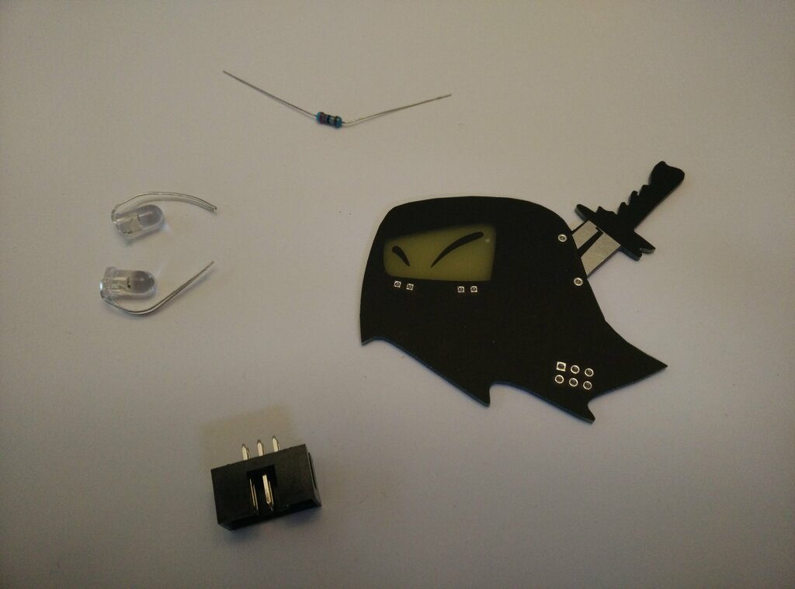

Your kit should have 5 compoenents
- 1x Mr. Fang badge
- 1x Resistor
- 1x SAO connector
- 2x LEDs

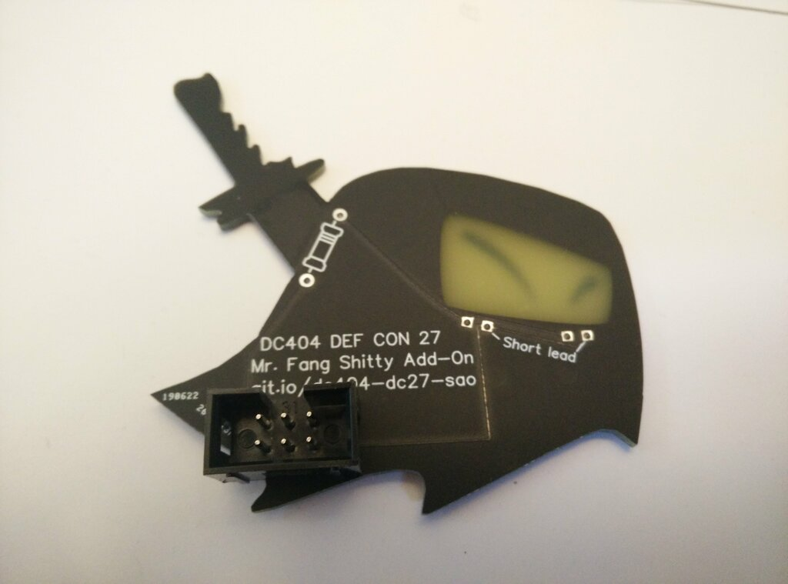

Position the connector with the key towards the top.

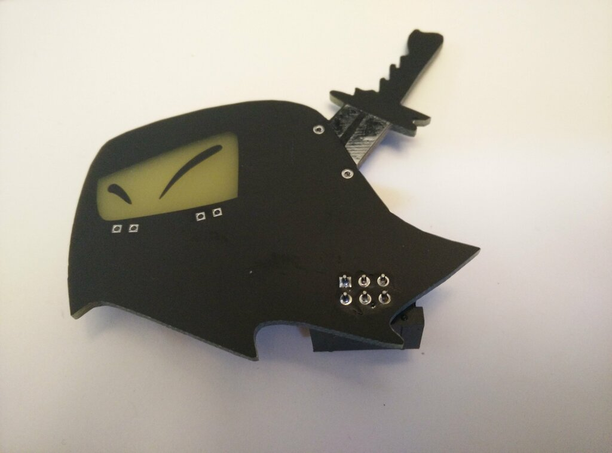

Solder all six pins. Even though only th square pin (v3.3) and the pin directly under (GND) are used, this will help keep the badge connected better.

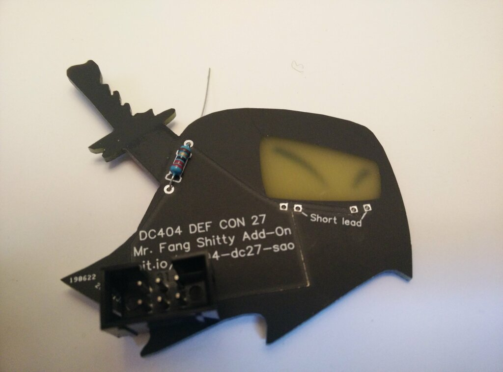

Attach the resistor near the sword. Direction doesn't matter.

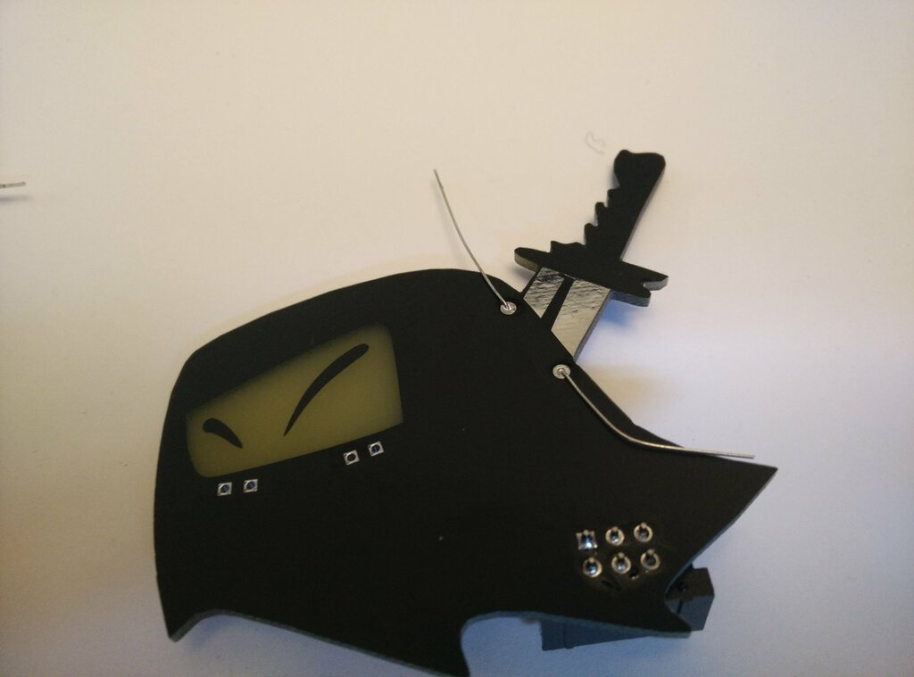

Bend the leads apart to help hold the resistor in place while soldering.

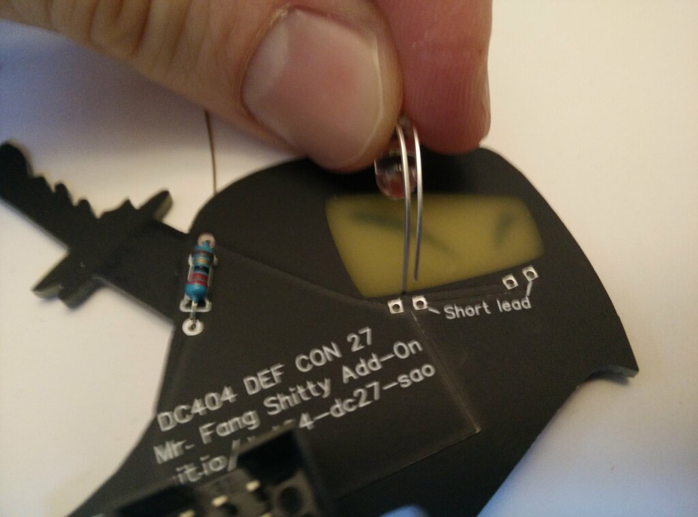

Attach the LEDs near the eyes. Make sure the short lead is on the right, as indicated on the board.

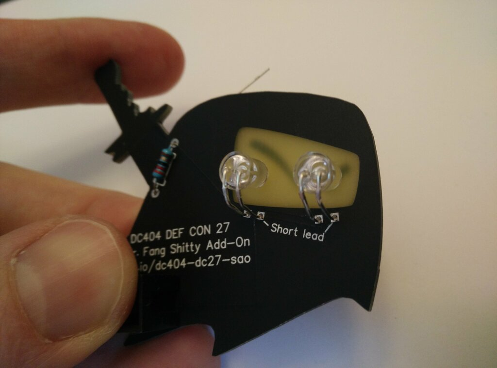

Adjust the LEDs so they shine directly though the face mask.

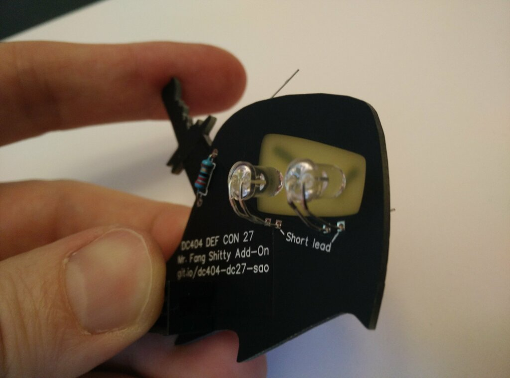

They're going to shine so great.

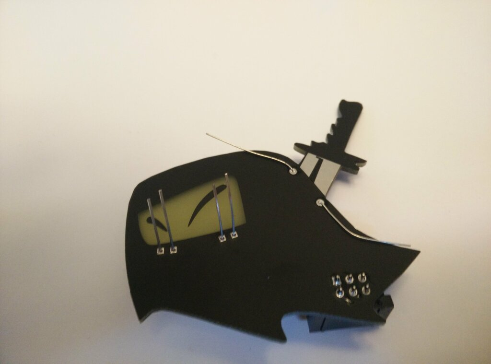

Solder the LEDs.

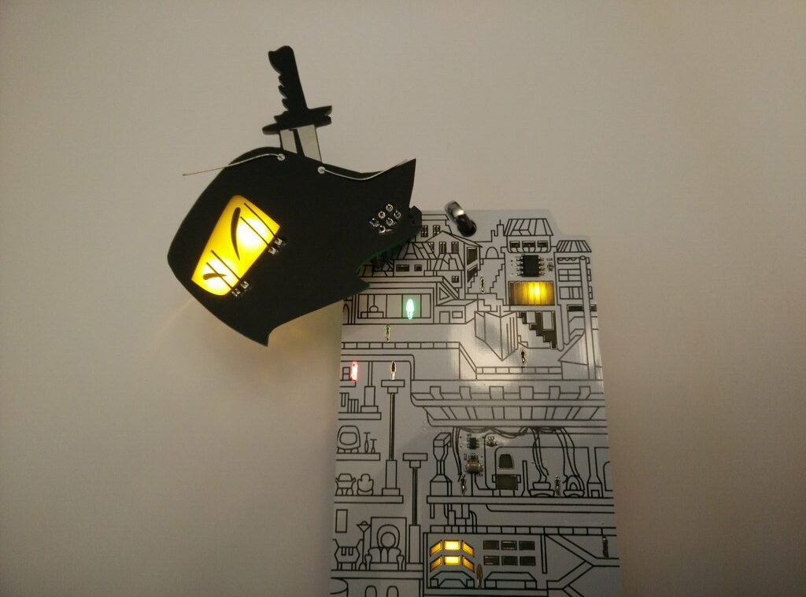

Before trimming the leads, plug in your completed badge and verify it works.

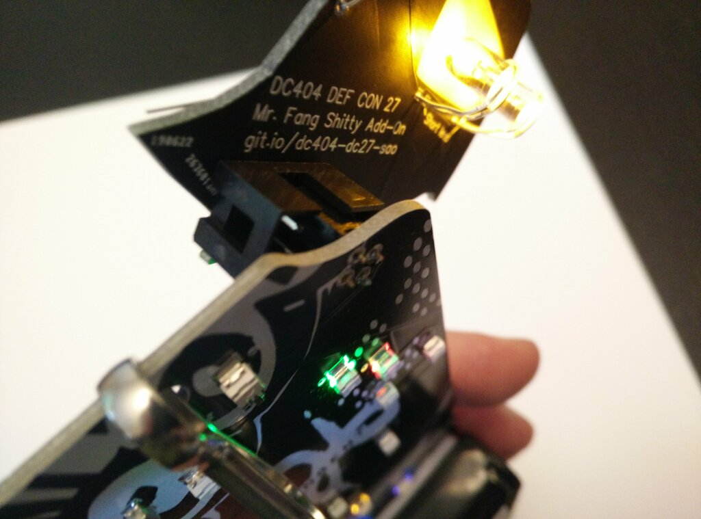

If using a badge with the older SAO header, Mr. Fang needs to be aligned like in this picture.

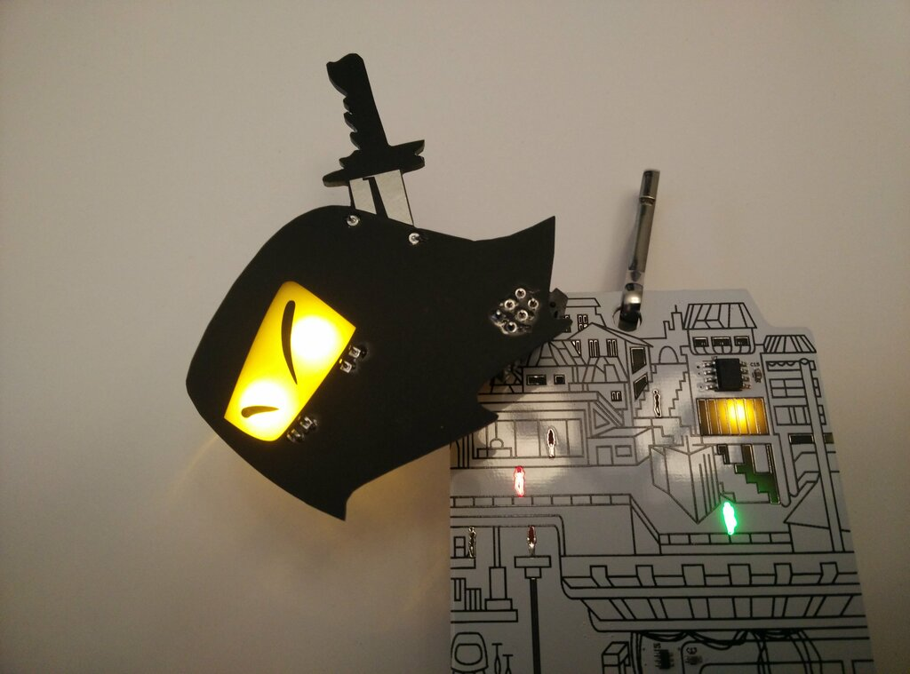

Trim the leads.

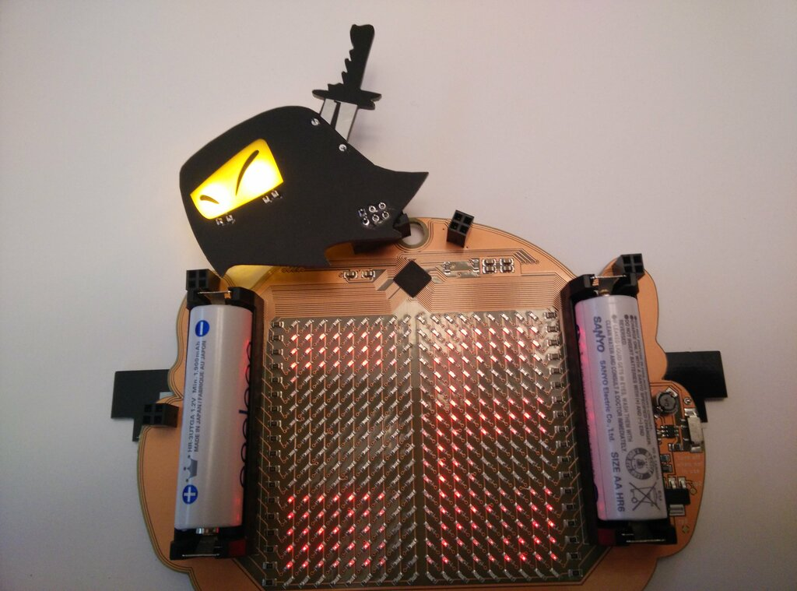

Enjoy your new Shitty Add-on.